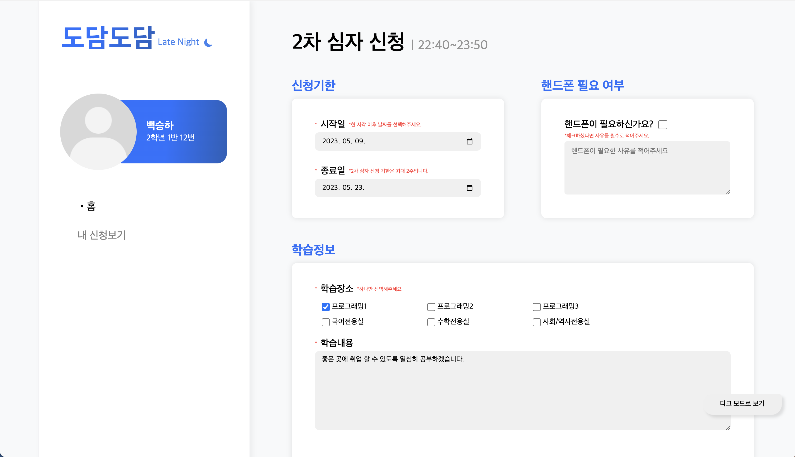

  

<h4 align="center">학생들을 위한, 학생들이 만든, 스마트스쿨 플랫폼</h4>

# [도담도담](https://dodam.b1nd.com/) 이란?

도담도담은 모든 학생과 모든 선생님에게 사고없이 편리함을 제공해줄 수 있는 스마트스쿨 플랫폼으로, 교내 전교생과 모든 선생님들이 사용하고 있어요.

> 아쉽지만 해당 서비스는 대소고학생 들만 사용할 수 있어요 🥲

# 도담도담 심자신청 페이지가 하는일은?

- 원래 직접 수기로 써 귀찮던 심자 신청을 편하게 웹으로 할 수 있어요.

더욱 상세한 기능은 아래와 같아요!

## 기능 리스트

- 심자 신청 기능
  - 신청기한, 핸드폰 필요 여부, 학습정보를 작성하여 심자 신청을 할 수 있어요.

# 화면

> 위 사진은 심자페이지 메인화면이에요. 신청기한, 핸드폰 필요 여부, 학습정보를 작성하여 쉽게 심자 신청을 할 수 있어요

# 기술 스택

`TypeScript`, `React`, `Recoil`, `React-Query`, `Styled-Components`, `Axios`
